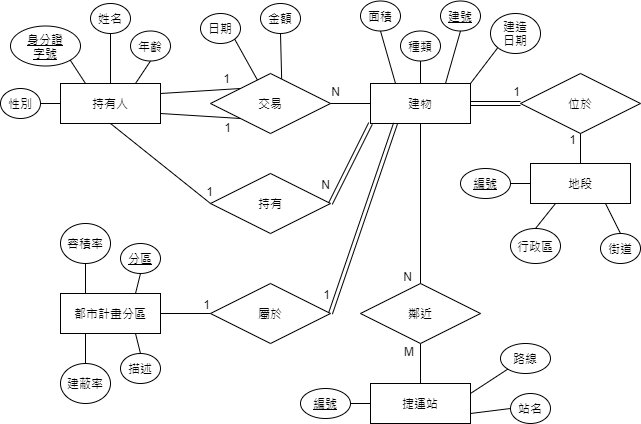
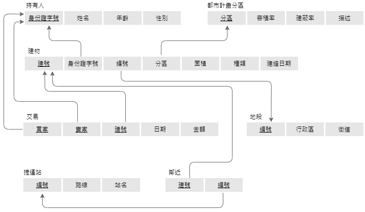
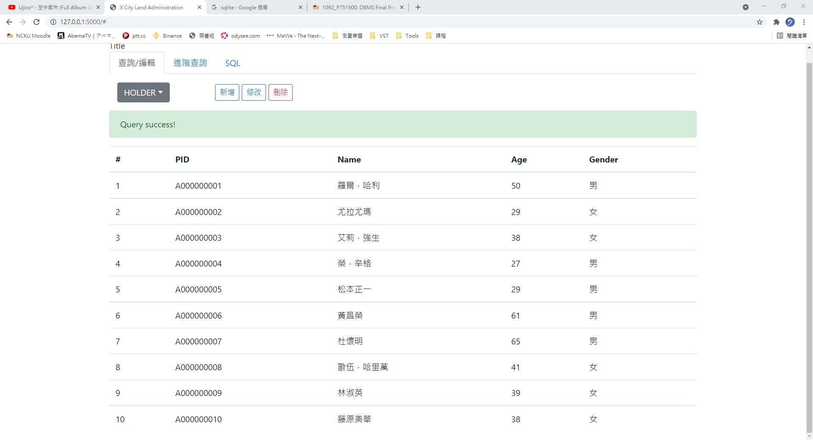
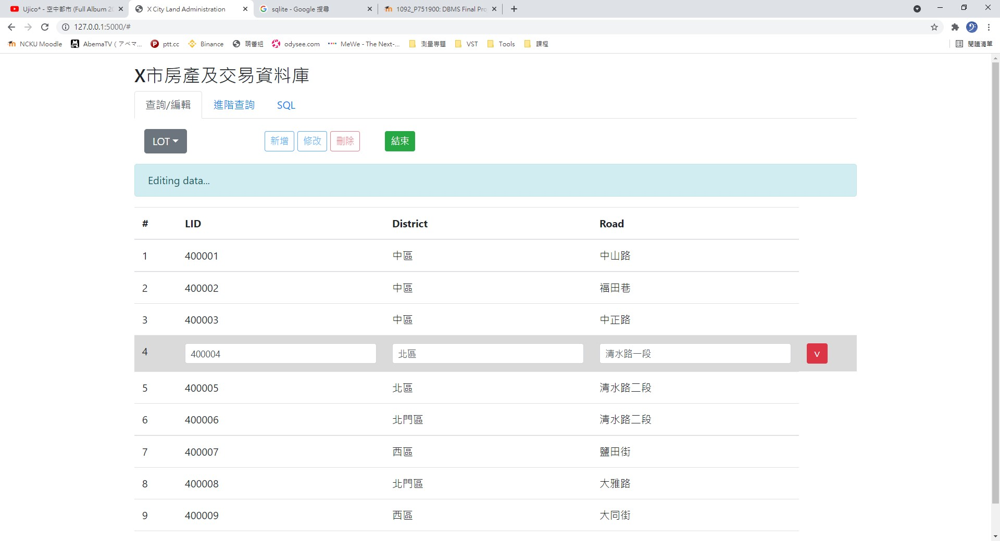
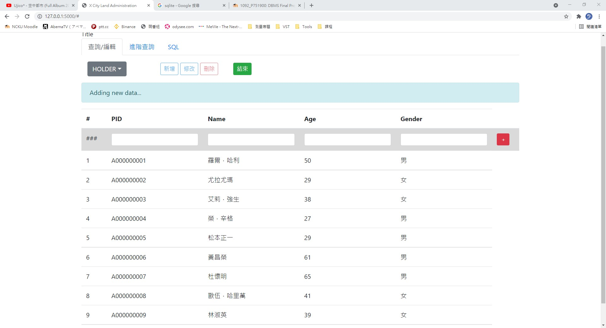
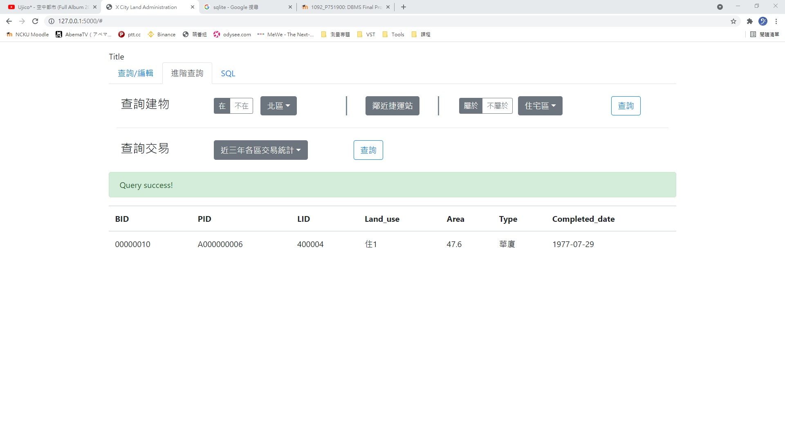
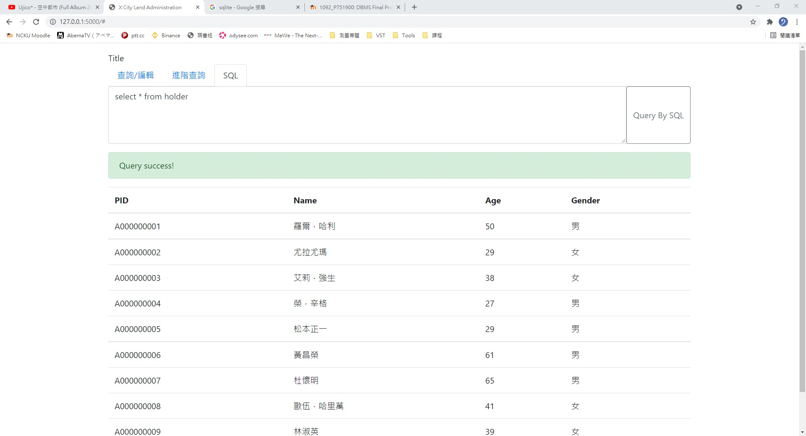

# DBMS 2021 Final Project
## 不動產履歷
X市規劃要推行不動產履歷系統，讓市民能夠即時上網查詢所有房屋的買賣交易以及房屋本身的詳細資訊，目的是為了讓房屋交易更透明，消除買賣雙方的資訊不對等，讓交易市場更健康。

### X市對於此系統的要求如下：
- 記錄房屋持有人的身分證字號、姓名、性別、年齡
- 記錄市內所有建物的建號、房屋種類、樓地板面積、建造日期
- 記錄市內的地段資料，包括地段編號、所屬行政區、街道名稱
- 記錄市內捷運站的資料，包括站點編號、路線名稱、站點名稱
- 記錄X市都市計畫相關法規中所規範的都市計畫分區，包括分區名稱、容積率、建蔽率，以及其他細節描述
- 追蹤記錄每筆交易的交易日期、金額，一筆交易可以同時移轉所有權人名下的多筆建物
- 根據X市的法規，一個市民可以擁有好幾間建物，但一間建物不能同時被多個人持有，建物不可分割或合併，且不會出現無主屋
- 所有建物都會位於某個行政區的某個街道上
- 所有建物都會被劃分進某個都市計畫區
- 建物可能會鄰近某些捷運站，此時會需要記錄下來，鄰近的定義為半徑800公尺內

### ER Diagram

### Relation Schema (已進行第三正規化)

### Metadata
#### BUILDING
X市裡的建物
- BID
    + String
    + 建號，共8碼
- PID
    + String
    + 持有人身分證字號
- LID
    + String
    + 地段編號
- Land_use
    + String
    + 土地利用分區
- Area
    + Real
    + 建地面積，單位：坪
- Type
    + String
    + 房屋種類
- Completed_date
    + String
    + 完工日期，YYYY-MM-DD
#### CITY_PLANNING
所有都市計畫的土地利用分區
- Land_use
    + String
    + 土地利用分區
- Floor_area_ratio
    + Integer
    + 容積率，單位：%
- Coverage_ratio
    + Integer
    + 建蔽率，單位：%
- Description
    + String
    + 土地利用分區之描述
#### HOLDER
房產持有者資料
- PID
    + String
    + 身分證字號，含英文字共10碼
- Name
    + String
    + 姓名
- Age
    + Integer
    + 年齡
- Gender
    + String
    + 性別
#### LOT
X市內所有地段
- LID
    + String
    + 地段編號，同行政區內一條路會有一個編號，共6碼
- District
    + String
    + 行政區名稱
- Road
    + String
    + 路名
#### METRO
X市內的捷運路線及站名
- StID
    + String
    + 捷運站編號
- Line
    + String
    + 路線名稱
- Station
    + String
    + 捷運站名
#### NEARYBY
記錄房屋是否鄰近捷運站(800m內)
- BID
    + String
    + 建號
- StID
     String
    + 捷運站編號
#### TRADE
記錄每筆房產交易資訊
- PID_buyer
    + String
    + 買方身份證字號
- PID_seller
    + String
    + 賣方身份證字號
- BID
    + String
    + 建號
- Date
    + String
    + 交易日期，YYYY-MM-DD
- Price
    + Real
    + 交易價格，單位：萬元

### 系統架構與環境
- Windows 10 x64, Google Chrome
- Client-Server架構
    + 前端：JQuery, Bootstrap
    + 後端：Python Flask
    + 資料庫：SQLlite

### 使用說明
#### 查詢/編輯
- 下拉式選單
    + 選擇要查詢的資料表後系統會顯示出來
    + 使用`SELECT-FROM-WHERE`指令
- "新增"按鈕
    + 選定資料表後可以新增欄位
    + 使用`INSERT`指令
- "修改"按鈕
    + 選定資料表後可以指定欄位做修改
    + 使用`UPDATE`指令
- "刪除"按鈕
    + 選定資料表後可以刪除指定的整筆資料
    + 使用`DELETE`指令
#### 進階查詢
- 查詢建物
    + 依照三種條件複合式的查詢想要的建物
        1. 在或不在某個行政區(使用`IN`和`NOT IN`指令)
        2. 房子附近有沒有捷運站(使用`EXISTS`指令)
        3. 房子屬於或不屬於某個都市計畫分區(使用`EXISTS`和`NOT EXISTS`指令)
- 查詢交易
    + 選擇不同條件來查詢交易
        1. 近三年各區交易統計(使用`COUNT`、`MAX`、`MIN`、`AVG`指令)
        2. 總交易額大戶，列出買賣總金額皆超過1000萬元的持有人之基本資訊及總交易額(使用`SUM`和`HAVING`指令)
#### SQL
- 直接使用SQL對資料庫下指令

#### 快照

